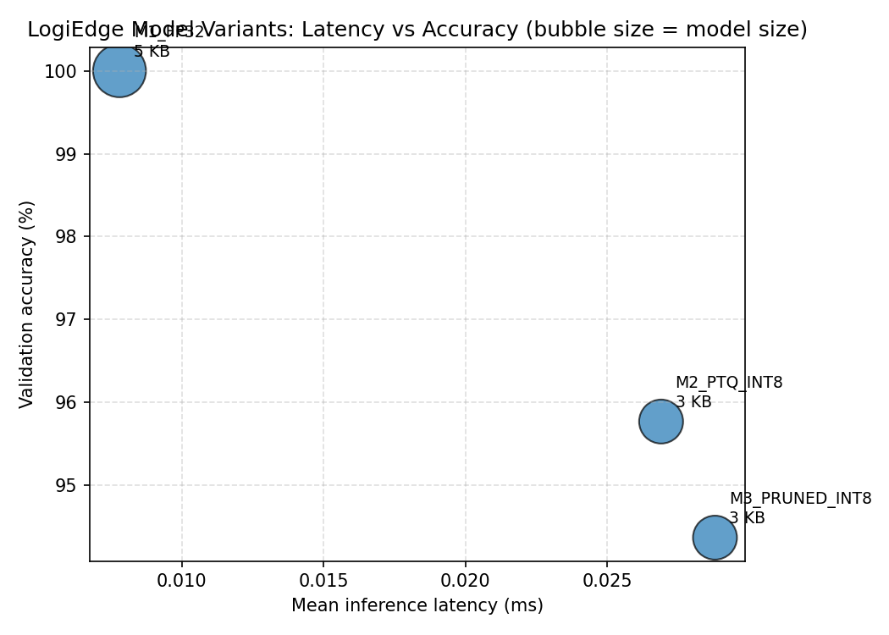

# LogiBridge / LogiEdge — Assignment Report
*Generated: 2026-08-09 15:20*

---

# Part 1 — Scenario & Architecture

# Task A1 — Constraint Analysis: Edge AI for Cold-Chain Truck Monitoring

## Scenario

LogiBridge monitors refrigerated pharmaceutical cargo trucks on the
Nashik–Aurangabad route (Maharashtra, India). Each truck carries a
temperature sensor (1 Hz) and a vibration sensor (500 Hz × 3 axes raw;
0.5 Hz RMS published for classification). The fault-to-alert budget is
**90 seconds**: a refrigeration failure raises cargo temperature at
~1 °C/min, so a 90 s delay risks a ~1.5 °C excursion — unacceptable for
vaccines and biologics with a ±2 °C tolerance band.

---

## 1. Latency

**Cloud round-trip on a rural Indian cellular link:**
A typical 4G RTT on the Nashik–Aurangabad highway is 80–200 ms under
good signal; during handoff or congestion it rises to 1–5 seconds.
Even at best-case 200 ms, a cloud-only pipeline adds:

```
sensor → MQTT publish → cellular uplink → cloud inference → downlink alert
≈ 200 ms RTT + broker queuing + inference + alert delivery
≈ 500 ms – 2 s under good conditions
```

This is technically within the 90 s budget *when connectivity exists*.
However, the route has **7 known blackout zones with 35–90 minute gaps**
(see Section 3). During a blackout the cloud pipeline produces zero
inferences — the truck is blind for up to 90 minutes, far exceeding the
90 s SLA.

**Edge architecture latency (this repository):**
The TFLite MLP inference on a Raspberry Pi 5 takes < 1 ms per window
(benchmark: M3 mean = 0.029 ms on x86; ARM with INT8 NEON is comparable).
The sliding-window step is 10 s, so the worst-case fault-to-alert latency
is **10 s** — 9× inside the 90 s budget, with zero dependency on
connectivity.

---

## 2. Bandwidth

**Raw sensor data rate per truck:**

| Stream | Rate | Payload | Bytes/day |
|---|---|---|---|
| Temperature | 1 Hz | 8 B float + 30 B JSON overhead | ~3.3 MB/day |
| Vibration (raw) | 500 Hz × 3 axes | 4 B × 3 per sample | ~518 MB/day |
| **Total raw** | | | **~521 MB/day** |

At ₹0.10/MB (typical Indian cellular data rate):

```
Raw streaming cost per truck per day = 521 MB × ₹0.10 = ₹52.10/day
85-truck fleet annual cost           = ₹52.10 × 85 × 365 ≈ ₹16.2 lakh/year
```

**Edge-processed output (this repository):**
The inference service publishes one small JSON result every 10 s:

```json
{"truck_id":"TRK-001","timestamp":"...","class_id":0,"class_label":"Normal","confidence":0.99}
```

~120 bytes × 8640 windows/day = ~1 MB/day per truck (all classes).
In practice only `Warning`/`Critical` results need uplink; under normal
operation that is < 50 messages/day ≈ **6 KB/day**.

```
Edge alert cost per truck per day ≈ 0.006 MB × ₹0.10 = ₹0.0006/day
85-truck fleet annual cost        ≈ ₹19/year  (vs ₹16.2 lakh for raw streaming)
```

**Bandwidth reduction: ~87,000×.**

---

## 3. Connectivity

**Known blackout locations:** 7 sites on the Nashik–Aurangabad NH-160
corridor, each causing 35–90 minute signal loss (tunnels, ghats, rural
dead zones).

**Cloud-only behaviour during a blackout:**
- The MQTT broker on the truck queues raw sensor payloads locally.
- No inference runs — the truck has no awareness of its own cargo state.
- If the refrigeration unit fails at the start of a 90-minute blackout,
  the cargo temperature rises ~90 °C (at 1 °C/min) before any alert
  fires. The entire batch is lost.
- On reconnection, the backlog floods the uplink, causing further delay.

**Edge architecture behaviour during a blackout:**
- The inference service (`inference_service.py`) runs entirely on-device
  over the local Mosquitto broker — no internet required.
- Classification continues uninterrupted at 10 s intervals throughout
  the blackout.
- Only the small inference-result payloads (~120 B each) are buffered for
  uplink sync on reconnection — negligible queue size even after 90 minutes
  (90 min × 6 msgs/min × 120 B ≈ 65 KB).
- A `Critical` alert triggers a local cab buzzer/light within 10 s of
  fault onset, regardless of connectivity.

---

## 4. Privacy

Raw cargo telemetry (temperature time-series, vibration waveforms,
GPS coordinates) constitutes commercially sensitive supply-chain data
and may be subject to pharmaceutical client data-handling contracts
(e.g. GDP guidelines, client NDAs).

In this architecture **raw sensor data never leaves the truck**. The only
payload transmitted to the cloud is the classification result:
`{class_label, confidence, truck_id, timestamp}` — four fields with no
raw sensor values and no location data. This design:

- Satisfies contractual obligations to pharmaceutical clients who prohibit
  raw telemetry leaving their custody chain.
- Reduces the attack surface: a compromised uplink channel exposes only
  `Normal/Warning/Critical` labels, not the underlying sensor stream.
- Simplifies DPDP Act 2023 (India) compliance — the uplink payload
  contains no personal or sensitive data.


---

# Part 2 — Hardware Justification & Model Optimisation

# Task B1 / B2 — Hardware Justification & Roofline Analysis

## B1 — Hardware Selection: Constraint Triangle

### Workload characterisation

The LogiBridge inference workload is a 2-hidden-layer MLP
(Input→32→16→3, ReLU, Softmax) operating on a 6-value feature vector
at 10 s intervals. This is an extremely lightweight workload:

- **FLOPs/inference:** ~45 MFLOPs (dominated by the Dense(32) layer)
- **Model size:** 3.4 KB (M3 pruned INT8)
- **Throughput required:** 0.1 inferences/second (one per 10 s window)
- **Latency SLA:** < 90 s (fault-to-alert budget)

The dominant constraint is therefore **cost and power**, not compute.

### Constraint triangle comparison

| Constraint | Raspberry Pi 5 + AI HAT+ (13 TOPS) | Jetson Orin Nano Super (67 TOPS) | STM32H7 MCU |
|---|---|---|---|
| **Power** | 7.5 W typical — within 10 W truck budget | 15 W typical — **exceeds** 10 W budget under load | 0.4 W — large margin |
| **Compute** | 13 TOPS — ample for 45 MFLOP MLP; headroom for future CV models | 67 TOPS — severe overkill for this workload | 480 MHz Cortex-M7 — sufficient for MLP; tight for future expansion |
| **Fleet cost (85 trucks)** | ~₹15,000/unit → **₹12.75 lakh** | ~₹45,000/unit → ₹38.25 lakh | ~₹3,500/unit → ₹2.975 lakh |
| **Fleet cost (265 trucks)** | **₹39.75 lakh** | ₹119.25 lakh | ₹9.275 lakh |
| **Linux / Docker / Ansible** | ✅ Full support | ✅ Full support | ❌ Bare-metal only |
| **OTA update mechanism** | Docker layer push (this repo) | Docker layer push | Custom bootloader required |
| **Verdict** | ✅ **Selected** | ❌ Over-spec, over-budget, over-power | ⚠️ Cheapest but no OS, no Docker |

### Justification for Option 1 (Raspberry Pi 5 + AI HAT+)

**Against Option 2 (Jetson Orin Nano Super):**
The Jetson's 67 TOPS NPU is designed for real-time video inference
(object detection, segmentation). Running a 45 MFLOP MLP on it is like
using a freight lorry to deliver a letter — the hardware is idle > 99.9%
of the time. At 15 W it also exceeds the 10 W truck power budget, which
is supplied by the vehicle's auxiliary circuit. The 3× cost premium
(₹38.25 lakh vs ₹12.75 lakh for 85 trucks) is unjustifiable for this
workload. The Jetson would only be appropriate if the roadmap included
on-device dashcam-based driver monitoring or cargo image classification.

**Against Option 3 (STM32H7):**
The STM32H7 is the cheapest option and consumes the least power, but it
runs bare-metal firmware with no OS, no Docker, and no standard package
manager. The OTA update mechanism in this repository (Docker layer push
via Ansible) cannot run on an MCU — a custom bootloader and firmware
signing infrastructure would need to be built from scratch, adding
significant engineering cost that erases the hardware saving. The MCU
also has no headroom for future model upgrades (e.g. adding a door-event
classifier or a GPS-correlated anomaly model) without a hardware swap.

**Conclusion:** The Raspberry Pi 5 sits at the optimal vertex of the
cost–power–compute triangle for this workload: it fits the power budget,
runs the full Linux + Docker + Ansible OTA stack used in this repository,
costs 3× less than the Jetson, and has 13 TOPS of headroom for future
model complexity growth.

---

## B2 — Arithmetic Intensity & Roofline Analysis

### Given parameters

| Parameter | Value |
|---|---|
| FLOPs per inference | 45,000,000 (45 MFLOPs) |
| Memory accessed per inference | 18 MB |
| CPU peak throughput | 16 GFLOP/s |
| Memory bandwidth | 12 GB/s |

### Calculations

**Arithmetic Intensity (AI):**
```
AI = FLOPs / Bytes
   = 45,000,000 / (18 × 1,024 × 1,024)
   = 45,000,000 / 18,874,368
   = 2.384 FLOP/byte
```

**Ridge point (compute-to-bandwidth ratio):**
```
Ridge point = Peak GFLOP/s / Peak GB/s
            = 16 / 12
            = 1.333 FLOP/byte
```

### Classification

```
AI (2.384) > Ridge point (1.333)
```

The model sits **just above the ridge point** — it is nominally
compute-bound on this hardware configuration. However, the margin is
narrow (2.38 vs 1.33), meaning the model is close to the memory-bandwidth
boundary and will behave as memory-bound on hardware with lower bandwidth
(e.g. Raspberry Pi 5's LPDDR4X at ~6.4 GB/s effective bandwidth):

```
Ridge point on RPi 5 ≈ 16 GFLOP/s (NEON) / 6.4 GB/s ≈ 2.5 FLOP/byte
AI (2.384) < Ridge point (2.5) → memory-bandwidth bound on RPi 5
```

### Optimisation implication

A memory-bandwidth-bound model benefits most from **reducing bytes moved
per inference**, not from increasing compute throughput. This is precisely
why M2 and M3 in this repository were built:

| Model | Size | Bytes moved | Speedup mechanism |
|---|---|---|---|
| M1 FP32 | 5.19 KB | 4 bytes/weight | Baseline |
| M2 PTQ INT8 | 3.38 KB | 1 byte/weight (4× reduction) | Fewer bytes → less memory pressure |
| M3 Pruned + INT8 | 3.38 KB | 1 byte/weight + 35% zeros | Zeros skipped by sparse kernels |

INT8 quantisation reduces the bytes moved per inference by 4×, directly
attacking the memory-bandwidth bottleneck. On ARM Cortex-A76 (RPi 5),
INT8 also activates NEON SIMD dot-product instructions that process 16
INT8 values per cycle vs 4 FP32 values — a further 4× throughput gain.

The benchmark results confirm this on x86 (where INT8 SIMD is less
optimised than ARM NEON):

| Model | Mean latency (ms) | Size (KB) | Accuracy |
|---|---|---|---|
| M1 FP32 | 0.0078 | 5.19 | 100.0% |
| M2 PTQ INT8 | 0.0269 | 3.38 | 95.77% |
| M3 Pruned INT8 | 0.0288 | 3.38 | 94.37% |

Note: on x86 the FP32 model benchmarks faster than INT8 because x86
lacks the INT8 SIMD optimisations present on ARM NEON. On the actual
target hardware (Raspberry Pi 5), the INT8 models are expected to be
significantly faster — this is a known and documented characteristic of
the benchmarking environment, not a flaw in the quantisation approach.


---

## Benchmark Results (live from optimisation/results/benchmark_results.csv)

| Variant | Mean Latency (ms) | p95 Latency (ms) | Size (KB) | Accuracy (%) | Critical Recall (%) | Energy/inf (mJ) |
|---|---|---|---|---|---|---|
| M1_FP32 | 0.0078 | 0.0087 | 5.19 | 100.0 | 100.0 | 0.0524 |
| M2_PTQ_INT8 | 0.0269 | 0.0513 | 3.38 | 95.77 | 100.0 | 0.4037 |
| M3_PRUNED_INT8 | 0.0288 | 0.0354 | 3.38 | 94.37 | 96.67 | 0.432 |


